# System Infrastructure Map & Orphan/Redundancy Audit

> **⚠️ FABLE PRE-REVIEW NOTE — READ THIS FIRST.**
> This map and audit were generated on Thursday for the Saturday Fable
> Pre-Review. Fable MUST read this document to resolve the Manager
> bypasses (e.g., `dhan_guard`) and orphan integrations (e.g.,
> `resonance`, `tuner`) before the unified push.

**Generated:** 2026-07-16 (Thursday), from the local tree at commit `b313177`.
**Method:** built by reading actual `src/` imports (top-level *and*
in-function/lazy) and file I/O paths — not from memory or MODULES.md.
Verified against a green suite (1077 passed after the
`test_market_loop` hermeticity fix).

---

## 1. System Infrastructure Map

Subgraphs are the seven Departments from `MODULES.md`. Nodes are modules,
state files (cylinders), scheduled entry points (with their cron time),
and UI endpoints. Edges are labelled with the data that flows across them.
Edges show the **primary runtime data path**, not every import.

```mermaid
flowchart TD
    %% ===== EXTERNAL =====
    USER(("User / Discord"))
    NSE["NSE / Google News / RSS feeds"]
    OLLAMA["Ollama (local, Mac only)"]
    GEMINI["Gemini API"]
    ANTHRO["Anthropic API (opt-in)"]

    %% ===== DATA =====
    subgraph DATA["1 · DATA (market data in)"]
        TOK["token_provider"]
        DHAN["dhan_client (SDK)"]
        GUARD["dhan_guard (SafeDhanClient · Manager)"]
        DFETCH["data_fetcher (compat shim)"]
        MS["market_snapshot.py"]
        SNAPF[("market_snapshot.json")]
        IND["indicators"]
        subgraph INGEST["Ingestion (cron)"]
            DEALS["deals_tracker · 19:30"]
            FLOWS["flows_tracker · 19:35"]
            EARN["earnings_calendar · 19:20"]
            MACRO["macro_tracker"]
            CHAIN["chain_archiver · 15:40"]
            DARCH["daily_archiver · 19:45"]
            NEWSP["news_processor · 19:10 (Gemini)"]
            RSS["rss_ingester · 18:50"]
            NP["news_parser"]
            TI["text_intelligence (Manager)"]
            LP["local_parser (Ollama)"]
        end
        LAKE[("data/lake/*")]
        NEWSJSON[("news_sentiment.json")]
        RSSJSON[("rss_signals.jsonl")]
    end

    %% ===== DECISION =====
    subgraph DECIDE["2 · DECISION PIPELINE (live engine)"]
        SCHED["master_scheduler · 09:10 (session daemon)"]
        MLOOP["market_loop"]
        LIVE["live_bridge"]
        VB["vol_bridge"]
        OP["options_proposer (run_headless / decide_pending)"]
        STRAT["strategy"]
        TP["trade_planner"]
        SUG["suggestions / suggest · 08:00"]
        FC["forecast"]
        SK["skeptic_agent"]
        CYC["cycles"]
        SIM["simulator"]
    end

    %% ===== RISK =====
    subgraph RISK["3 · RISK & CAPITAL (gatekeeper)"]
        EG["exposure_gate"]
        PM["portfolio_manager (capital/margin)"]
        PT["plan_tracker (exit/settlement)"]
        PORT["portfolio"]
        WL["wealth_lock"]
        PG["portfolio_greeks · 2h"]
        PERF["performance · Sat 10:05"]
        BC["book_context"]
        POS["positions"]
    end

    %% ===== MEMORY =====
    subgraph MEM["4 · MEMORY & LEARNING"]
        JOURNAL[("journal.jsonl")]
        BRAIN[("brain_map.db")]
        GE["graph_engine"]
        SLEEP["sleep_phase · 20:00 (+apply_decay)"]
        DECAY["decay_engine (ORPHAN)"]
        TUNER["tuner (ORPHAN)"]
        WEIGHTS[("brain_weights.json")]
        REG["regime"]
        EVO["evolution (Mac)"]
        ANALYST["analyst (post-mortem)"]
        DC["daily_context"]
        EA["entity_affinity"]
        EM["edge_miner (Mac)"]
        RES["resonance (ORPHAN)"]
    end

    %% ===== VALIDATION =====
    subgraph VALID["5 · VALIDATION HARNESS"]
        REGISTRY["registry"]
        GATES["stat_gates"]
        TRIAL["trial"]
        MON["monitor"]
        NOISE["noise"]
        PLAC["placebo"]
        DIG["digest · Sat 10:00"]
        TL["timelock"]
        COOC["cooccurrence_miner"]
        SEQ["sequence_miner"]
        SHAD["shadow_runner"]
        RUNM["run_miners (manual)"]
        NIGHT["discovery.nightly · 20:20"]
        SE["strategy_evidence (ORPHAN)"]
        MFE["mfe_mae_analyzer (ORPHAN)"]
    end

    %% ===== REPORTING =====
    subgraph REPORT["6 · REPORTING"]
        NOTIF["notifier (fire_broadcast)"]
        DCLIENT["discord_client"]
        EOD["eod_summary · 15:30"]
        OPS["ops_monitor · 20:30"]
        PREPORT["portfolio_report · 2h"]
    end

    %% ===== INTERFACES =====
    subgraph IFACE["7 · INTERFACES"]
        API["api (FastAPI /api/*, /dashboard)"]
        APISRV["api_server (gateway, systemd)"]
        BOT["discord_bot (systemd)"]
        CHAT["chat_agent (Mac, manual)"]
        DASH["dashboard.html"]
        TUNNEL["cloudflared tunnel (systemd)"]
        WATCH["watchlist_store"]
        RENEW["renew_token · 07:00"]
        MAIN["main · 15:35 (alerts)"]
    end

    %% ---- DATA edges ----
    NSE -->|scrip + OHLC| DHAN
    TOK -->|access token| DHAN
    DHAN --> GUARD
    DHAN -->|get_quote| DFETCH
    RENEW -->|mints token| TOK
    LIVE -->|per-cycle marks| MS --> SNAPF
    NSE --> DEALS & FLOWS & EARN & CHAIN & MACRO
    DEALS --> LAKE & EA
    FLOWS --> LAKE
    EARN --> LAKE & CYC
    CHAIN --> LAKE
    DARCH --> LAKE
    NEWSP -->|Gemini score| NEWSJSON
    NEWSP --> GEMINI
    RSS --> NP --> TI --> LP --> OLLAMA
    TI -.claude backend.-> ANTHRO
    RSS --> RSSJSON
    MACRO --> RES
    NP -->|5-key frame| RES

    %% ---- DECISION edges ----
    SCHED -->|spawns| MLOOP & LIVE
    DHAN -->|Live Spot Price| MLOOP
    VB -->|regime overrides| OP
    MLOOP -->|market state| OP
    OP --> STRAT & TP & SK & CYC
    NEWSJSON -->|sentiment| FC
    WEIGHTS -->|learned weights| FC
    REGISTRY -->|registry stamp| FC
    SIM -->|as-of replay| OP
    SIM --> BRAIN

    %% ---- RISK edges ----
    OP -->|exposure check| EG -->|verdict| OP
    OP -->|margin gate| PM -->|lock/reject| OP
    OP -->|book_line| BC
    OP -->|Proposal Card PENDING| JOURNAL
    OP -->|Proposal embed| NOTIF
    PT -->|resolve vs OHLC| JOURNAL
    PT -->|post-mortem| ANALYST -->|variance JSON| BRAIN
    PT -->|realized PnL| PM -->|settle/peak| BRAIN
    PM -->|profit sweep| WL --> NOTIF
    PT -->|closed / stop embed| NOTIF
    GUARD -->|marks| PG & PREPORT
    SNAPF -->|cached marks| PREPORT
    PG --> NOTIF
    PERF --> NOTIF
    PT --> POS --> API

    %% ---- MEMORY edges ----
    JOURNAL -->|ingest| BRAIN
    BRAIN --> TUNER -->|writes| WEIGHTS
    SLEEP -->|decay + consolidate| BRAIN
    SLEEP --> DC -->|market frame| BRAIN
    EA -->|affinity edges| BRAIN
    REG --> BRAIN
    EM -->|causal triples| GE --> BRAIN
    EVO -->|param candidates| BRAIN

    %% ---- VALIDATION edges ----
    BRAIN -->|resolved txns| COOC & SEQ
    NIGHT --> COOC & SEQ
    RUNM --> COOC & SEQ
    COOC & SEQ -->|candidates| REGISTRY
    COOC --> GATES
    REGISTRY --> TRIAL --> GATES
    TRIAL -->|shadow_trades| BRAIN
    SHAD --> BRAIN
    MON -->|CUSUM quarantine| REGISTRY
    MON --> NOTIF
    PLAC --> GATES
    DIG --> NOTIF

    %% ---- REPORTING + INTERFACES edges ----
    NOTIF --> DCLIENT -->|Discord Webhook| USER
    EOD --> NOTIF
    OPS -->|health card| NOTIF
    OPS -->|heartbeats| API
    API --> DASH
    APISRV -->|mounts| API
    TUNNEL --> APISRV
    USER -->|approve / reject| APISRV -->|decide_pending| OP
    USER -->|/analyze| BOT --> FC
    CHAT -->|portfolio snapshot| BRAIN
    WATCH --> API
    MAIN -->|alerts| NOTIF
```

---

## 2. Orphan & Redundancy Audit

Every item is evidence-based against the current tree. "No importer" =
nothing in `src/` imports it at any depth. "Not scheduled" = absent from
`scripts/setup_cron.sh` and the launchd plists.

### 2.1 Orphans (built, disconnected from the loop)

| Module | Evidence | Verdict |
|---|---|---|
| **`decay_engine.py`** | 0 importers, not in cron. `sleep_phase.py` already runs its own `apply_decay` (line 304). | **Dead duplicate** — the decay it provides is done elsewhere; nothing calls this file. |
| **`tuner.py`** | 0 importers, not in cron. It is the *only* writer of `brain_weights.json`, which `forecast.py` reads. | **Dormant learning loop** — nothing runs it, so the learned weights `forecast` consumes are never regenerated. Schedule it, or `forecast` reads a frozen/absent file. |
| **`knowledge_graph/resonance.py`** | 0 importers, not in cron. Only writes `logs/resonance_advisories.jsonl`. | **Built (Phase 7), never wired.** Its upstream feeders (`macro_tracker`, `news_parser`) run only to reach a consumer that never executes. |
| **`calibration/mfe_mae_analyzer.py`** | 0 importers, not in cron, CLI-only. | Advisory CLI, never in the automated flow. |
| **`discovery/strategy_evidence.py`** | 0 importers, not in cron, CLI-only. | Read-only substrate, manual-only. |
| **Inspection CLIs** — `explain.py`, `discovery/inspect.py`, `graph_viz.py`, `view_positions.py` | 0 importers, not in cron. | Human tools by design (not bloat), but confirmed outside the engine/UI flow. Listed for completeness. |

### 2.2 Redundancies (two modules, one job)

1. **`decay_engine.py` ⟷ `sleep_phase.apply_decay`** — two implementations
   of the same exponential-decay sweep over `brain_map.db`. `decay_engine`
   is the unused one.
2. **`data_fetcher.py` ⟷ `dhan_client.get_quote`** — `data_fetcher` is
   explicitly a thin re-export (compat shim). Still imported by `api`,
   `main`, `review`, `watchlist_store`, so it can't just be deleted, but
   it's a pure pass-through layer.
3. **`dhan_guard` (the "Manager") is bypassed.** `dhan_guard` is documented
   as the single hardened door to market data, but **11 modules import raw
   `dhan_client` directly** — the entire live path: `options_proposer`,
   `market_loop`, `live_bridge`, `simulator`, `plan_tracker`,
   `exposure_gate`, `suggestions`, `skeptic_agent`, plus `chain_archiver`,
   `macro_tracker`, `news_parser`. The audited/rate-limited seam only
   actually guards `portfolio_report`, `portfolio_greeks`, and `mfe_mae`.
   **← Fable: this is the top Manager bypass to resolve.**
4. **Three overlapping news/text pipelines, two dead-ended:**
   - `news_processor` (Gemini) → `news_sentiment.json` → **read by
     `forecast`** ✅ the only one feeding a decision.
   - `rss_ingester` → `rss_signals.jsonl` → **nothing reads this file.**
   - `news_parser` (5-key frame) → **only consumer is `resonance`, itself
     an orphan.**
5. **`local_parser` ⟷ `text_intelligence`.** `text_intelligence` (#74) was
   built to be *the* text→JSON manager wrapping `local_parser`, but
   `local_parser` is still imported directly by `news_parser`,
   `edge_miner`, `evolution`, and `sleep_phase`. The manager seam did not
   replace the thing it wraps — both are live.
6. **`discovery/nightly` ⟷ `discovery/run_miners`.** Two orchestrators over
   the same two miners — `nightly` (scheduled + gated, #76) and
   `run_miners` (manual honest-report). Candidate to collapse into one
   entry point with a `--gated` flag.
7. **`review.py` (legacy)** — a 7-day price-drift scorecard living
   alongside `plan_tracker`'s real bracket-resolution, kept only for
   pre-plan journal entries. Legacy tail.

### 2.3 Net assessment

The **live trading path is clean and fully connected.** The bloat is
concentrated in the **learning/discovery and news-ingestion peripheries**:
`tuner` and `resonance` are wired to files but never executed,
`decay_engine` is a straight duplicate, and the news layer runs three
pipelines where only one reaches a decision. These are the wire-up-or-retire
candidates for the Fable review, alongside the `dhan_guard` Manager bypass.
